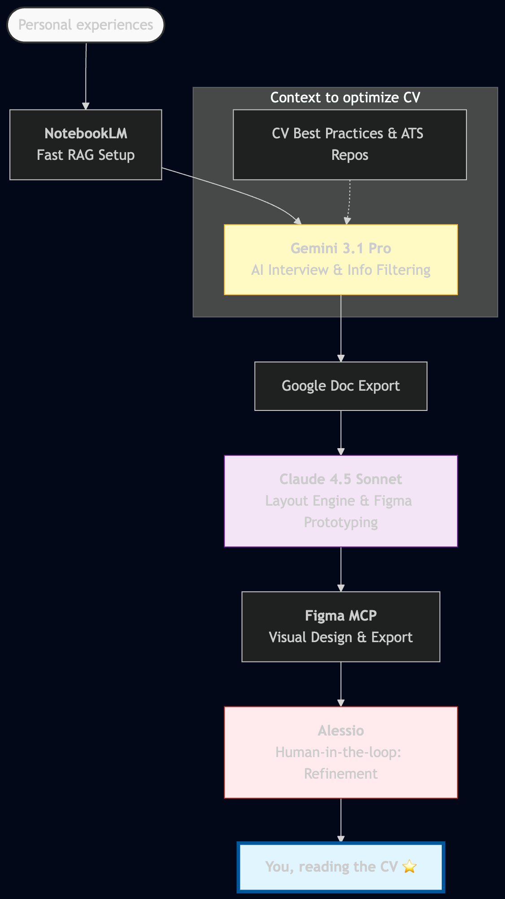
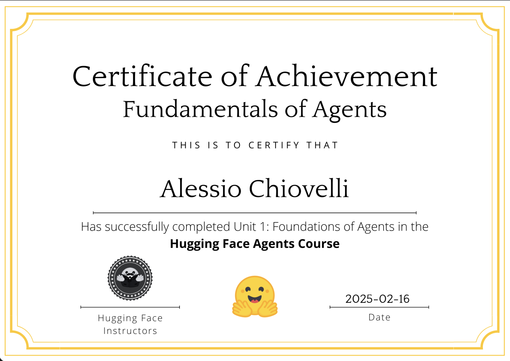
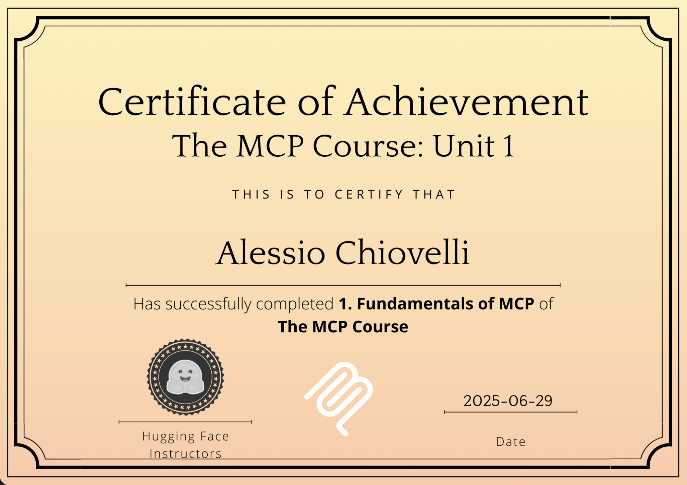
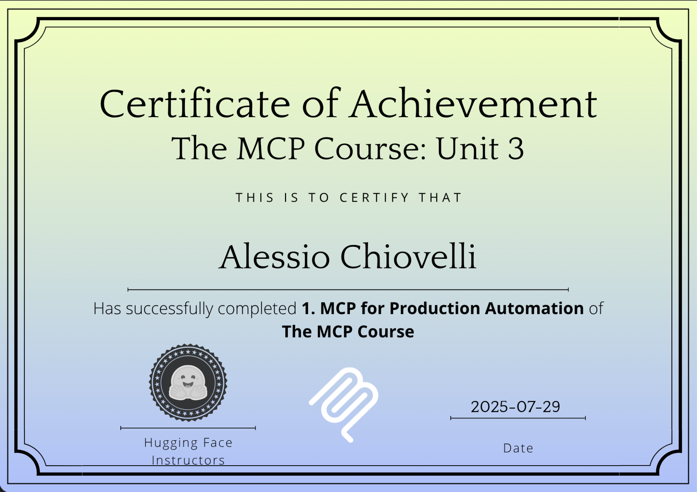
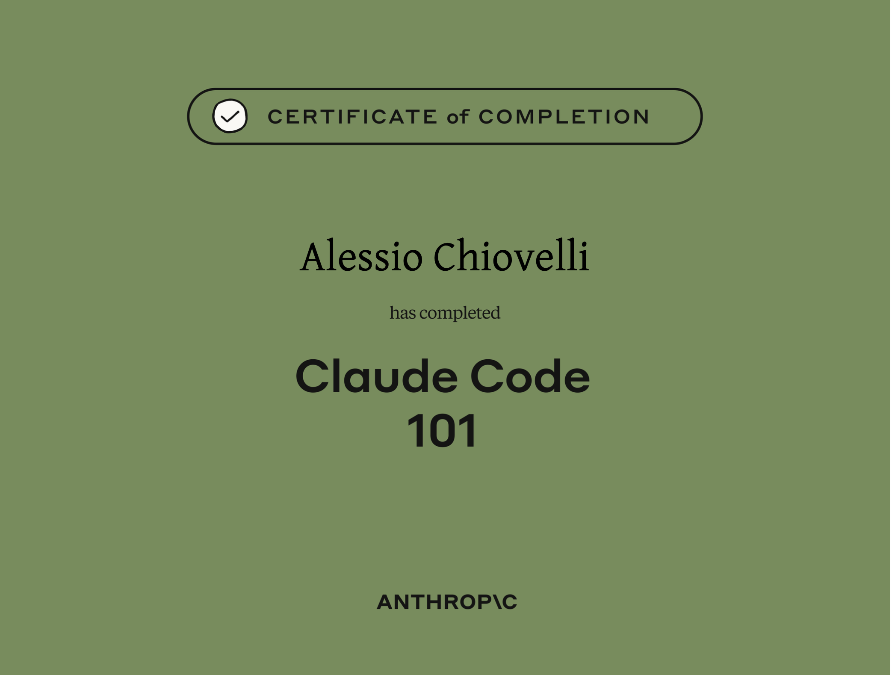

# Alessio Chiovelli

## Come creo i miei CV / How i create my CVs

---

## Certificazioni / Certifications

### Agent Course Fundamentals

### Huggingface MCP Unit 1

### Huggingface MCP Unit 3

### [Claude code](claude-code.pdf)

---

## Referenze / References

| Certificazione | Italiano | English |
|---|---|---|
| **Agent Course Fundamentals** | Certificato completamento corso agenti AI | Completion certificate of AI agents course |
| **Huggingface MCP Unit 1** | Certificato completamento unità 1 del corso MCP su Huggingface | Completion certificate of unit 1 from Huggingface MCP course |
| **Huggingface MCP Unit 3** | Certificato completamento unità 3 del corso MCP su Huggingface | Completion certificate of unit 3 from Huggingface MCP course |

## Pubblicazioni / Publications

[**Colorization Network Watermarking in the CIE-Lab Domain**](https://ieeexplore.ieee.org/document/10887863) — [PDF](PaperColorizationGAN.pdf)